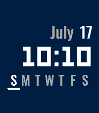
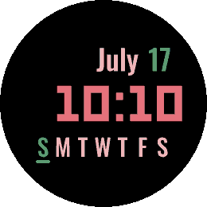
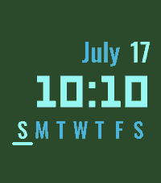
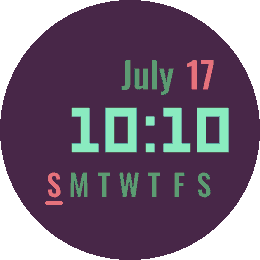
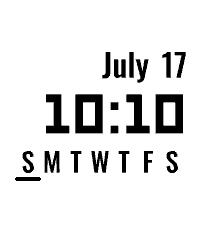

# pebble-blotch

### A rewrite of [Marked 2](https://apps.rebble.io/en_US/application/52aeeadab2a37d1efb000002) in C

A user on the Rebble discord posted recently that they loved the [Marked 2](https://apps.rebble.io/en_US/application/52aeeadab2a37d1efb000002) watchface, but since the original developer's website was down they were unable to change certain settings. I decided to take this opportunity to learn how to create watchfaces for Pebble, and used a combination of my miniscule C knowledge, the Pebble developer documentation, and GitHub Copilot to write this.

## Fonts

Version 2.0 uses scalable fonts via [pebble-fctx](https://github.com/jrmobley/pebble-fctx):
- **Oswald Medium** - date and weekday letters  
- **LECO 1976** - time display

## Screenshots

### Download Link
Want to try it out? You can install it now from the [Rebble store](https://apps.rebble.io/en_US/application/67ae29f70554c60009de76df)!

### Todo
- [x] Preferences
- [x] PTR Support
- [x] Add images
- [x] Scalable fonts (pebble-fctx)
- [ ] Customizable fonts
    - LECO
    - Bitham Bold
    - Bitham Light
- [ ] Battery percentage
- [x] Separate date and week color customization
- [ ] Week starting day customization
- [ ] Adjustable underline size
